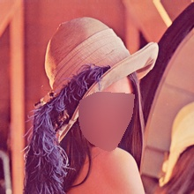

# FaceDeleteBot
Simple Telegram bot for blurring faces on the image

# Installation
Python 3.7 or above required
1. Install dependencies: `pip install -r requirements.txt`
2. Download [model](https://github.com/opencv/opencv_3rdparty/blob/b2bfc75f6aea5b1f834ff0f0b865a7c18ff1459f/res10_300x300_ssd_iter_140000.caffemodel) (rename it to `opencv_face_detector.caffemodel`) and [prototxt](https://github.com/opencv/opencv/blob/3bf22d00240bdaa2496fb7a4e96ada49e5b40156/samples/dnn/face_detector/deploy.prototxt), copy them to `models/` folder
3. Place your Telegram bot token in the `token.txt` file
4. Use:
	* `python bot.py` to run bot 
	* `python engine.py test_images/lena.png` to test engine locally on a some demo

# TODOs
* Improve face detection algorithm (see test `band.jpg` and pictures with crowd). Possible ways:
  * crop the image (remove backgrounds) before sending it to the detector input
  * or use other deep learning techniques (MTCNN) 
* Improve performance under large number of queries